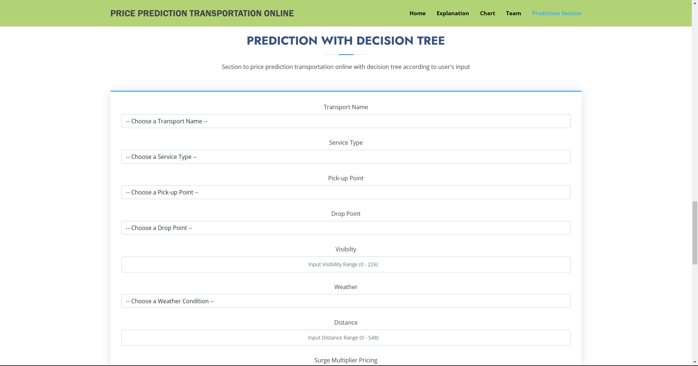

# Final Project 1 - Linear Regression

## Latar Belakang

Dalam proyek ini, kami akan mencoba memprediksi dua perusahaan jasa transportasi manakah yang memiliki tarif harga termurah antara Uber dan Lyft berdasarkan 8 atribut yang memiliki korelasi dengan atribut harga dengan menggunakan Linear Regression dan Decision Tree.

## Objektif 

Final Project 1 ini dibuat guna mengevaluasi konsep Regression sebagai berikut:  
- Mampu memahami konsep regression dengan Linear Regression
- Mampu mempersiapkan data untuk digunakan dalam model Linear Regression
- Mampu mengimplementasikan Linear Regression untuk membuat prediksi

## Ulasan Proyek

Database ini memiliki 57 atribut, tetapi yang paling relevan ada 10 atribut dari semuanya.

## Menjalankan PYTN_KampusMerdeka_fp1_ShendyKrisyohanda

1. Download dataset <a href="https://www.kaggle.com/datasets/brllrb/uber-and-lyft-dataset-boston-ma">Uber and Lyft Dataset Boston, MA</a>
2. Extract Zip 
3. Put `rideshare_kaggle.csv` into folder `dataset`
4. Run PYTN_KampusMerdeka_fp1_ShendyKrisyohanda.ipynb

## Menjalankan Website 
1. Make Folder `Final Project 1`
2. Make environment variable with command `python -m venv venv` in cmd prompt
3. Download this repository
4. Move folder `model, static, templates` and file `app.py and requirement.txt` into `Final Project 1`
5. Activate environment with `venv/Scripts/activate` with cmd prompt
6. After activated, type this `pip install -r requirements.txt`
7. Type this `$env:FLASK_APP="app.py"` and then `flask run`  

## Tampilan Website

- Tampilan Secara Keseluruhan

- Tampilan Home

- Tampilan Explanation

- Tampilan Chart

- Tampilan Team

- Tampilan Prediction Section (Decision Tree)

- Tampilan Prediction Section (Linear Regression)

- Output Decision Tree

- Output Linear Regression
